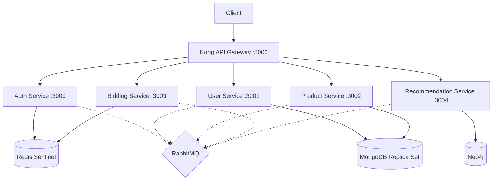

# Design Document: E-Auction Platform dengan Polyglot Persistence

## Overview

This is a backend-only microservices-based e-auction platform using NestJS with polyglot persistence. The system consists of 5 microservices (Auth, User, Product, Bidding, Recommendation) communicating via HTTP and RabbitMQ, fronted by Kong API Gateway.

## Architecture



## Components and Interfaces

### 1. Auth Service (Port 3000)
- **Database**: Redis with Sentinel (session storage)
- **Responsibilities**: User authentication, JWT token management, session handling
- **Endpoints**:
  - `POST /auth/register` - Register new user
  - `POST /auth/login` - User login
  - `POST /auth/logout` - User logout
  - `POST /auth/refresh-token` - Refresh JWT token
  - `GET /auth/verify` - Verify session

### 2. User Service (Port 3001)
- **Database**: MongoDB Replica Set
- **Responsibilities**: User CRUD, profile management
- **Endpoints**:
  - `POST /users` - Create user
  - `GET /users/:id` - Get user by ID
  - `PUT /users/:id` - Update user
  - `DELETE /users/:id` - Soft delete user
  - `GET /users/:id/profile` - Get user profile
  - `PUT /users/:id/profile` - Update profile
  - `GET /users/seller/:sellerId/products` - Get seller's products
  - `GET /users/buyer/:buyerId/bids` - Get buyer's bids

### 3. Product Service (Port 3002)
- **Database**: MongoDB Replica Set
- **Responsibilities**: Product CRUD, auction lifecycle management
- **Endpoints**:
  - `POST /products` - Create product
  - `GET /products/:id` - Get product
  - `PUT /products/:id` - Update product
  - `DELETE /products/:id` - Soft delete product
  - `GET /products` - List products with pagination
  - `GET /products/seller/:sellerId` - Get seller's products
  - `GET /products/category/:category` - Get products by category
  - `GET /products/:id/auction-status` - Get auction status
  - `PUT /products/:id/start-auction` - Start auction
  - `PUT /products/:id/end-auction` - End auction

### 4. Bidding Service (Port 3003)
- **Database**: Redis with Sentinel (sorted sets for bids)
- **Responsibilities**: Bid placement, bid history, winner determination
- **Endpoints**:
  - `POST /bids` - Place bid
  - `GET /bids/product/:productId` - Get product bids
  - `GET /bids/product/:productId/highest` - Get highest bid
  - `GET /bids/user/:userId` - Get user's bids
  - `GET /bids/product/:productId/winner` - Get auction winner

### 5. Recommendation Service (Port 3004)
- **Database**: Neo4j
- **Responsibilities**: Product recommendations, similarity analysis
- **Endpoints**:
  - `GET /recommendations/user/:userId` - Get user recommendations
  - `GET /recommendations/product/:productId/similar` - Get similar products
  - `POST /recommendations/train` - Rebuild recommendation graph

## Data Models

### Redis Session Model (Auth Service)
```typescript
interface Session {
  userId: string;
  email: string;
  role: 'buyer' | 'seller';
  createdAt: number;
  expiresAt: number;
}
// Key: session:{sessionId}, TTL: 24h

interface RefreshToken {
  token: string;
  expiresAt: number;
}
// Key: refresh:{userId}, TTL: 7d
```

### MongoDB User Model (User Service)
```typescript
interface User {
  _id: ObjectId;
  email: string;
  password: string;
  role: 'buyer' | 'seller';
  profile: {
    name: string;
    phone: string;
    address: {
      street: string;
      city: string;
      province: string;
      postalCode: string;
    };
    avatar: string;
  };
  seller?: {
    companyName: string;
    description: string;
    rating: number;
    totalSales: number;
  };
  buyer?: {
    totalBids: number;
    totalWins: number;
  };
  createdAt: Date;
  updatedAt: Date;
  deletedAt?: Date;
}
```

### MongoDB Product Model (Product Service)
```typescript
interface Product {
  _id: ObjectId;
  sellerId: string;
  title: string;
  description: string;
  category: string;
  images: string[];
  startingPrice: number;
  currentPrice: number;
  buyNowPrice?: number;
  condition: 'new' | 'used';
  specifications: Record<string, any>;
  auction: {
    status: 'draft' | 'active' | 'ended' | 'cancelled';
    startTime?: Date;
    endTime?: Date;
    winnerId?: string;
    totalBids: number;
  };
  createdAt: Date;
  updatedAt: Date;
  deletedAt?: Date;
}
```

### Redis Bid Model (Bidding Service)
```typescript
interface Bid {
  bidId: string;
  productId: string;
  userId: string;
  amount: number;
  timestamp: number;
  status: 'active' | 'outbid' | 'winner';
}
// Key: bid:{bidId}, TTL: 30d after auction ends
// Sorted Set: bids:{productId}, Score: amount, Member: {userId}:{amount}:{timestamp}
```

### Neo4j Graph Model (Recommendation Service)
```cypher
// Nodes
(:User {userId, role})
(:Product {productId, category, title})
(:Category {name})

// Relationships
(:User)-[:VIEWED {timestamp}]->(:Product)
(:User)-[:BID {amount, timestamp}]->(:Product)
(:User)-[:WON {timestamp}]->(:Product)
(:Product)-[:BELONGS_TO]->(:Category)
(:Product)-[:SIMILAR_TO {score}]->(:Product)
```

## Correctness Properties

*A property is a characteristic or behavior that should hold true across all valid executions of a system-essentially, a formal statement about what the system should do. Properties serve as the bridge between human-readable specifications and machine-verifiable correctness guarantees.*

### Property 1: Session Round Trip
*For any* valid user credentials, creating a session and then verifying it should return the same user information.
**Validates: Requirements Auth Service - Login/Verify**

### Property 2: Bid Ordering Consistency
*For any* set of bids on a product, the sorted set should always return bids in descending order by amount.
**Validates: Requirements Bidding Service - Get Product Bids**

### Property 3: Highest Bid Invariant
*For any* product with bids, the highest bid should always be greater than or equal to all other bids and the starting price.
**Validates: Requirements Bidding Service - Get Highest Bid**

### Property 4: Auction State Machine
*For any* product, auction status transitions should follow: draft → active → (ended | cancelled). No other transitions are valid.
**Validates: Requirements Product Service - Auction Lifecycle**

### Property 5: Soft Delete Preservation
*For any* soft-deleted user or product, the data should remain in the database with deletedAt set, and should not appear in normal queries.
**Validates: Requirements User Service, Product Service - Delete**

### Property 6: Bid Validation Invariant
*For any* bid placement, the bid amount must be strictly greater than the current highest bid (or starting price if no bids exist).
**Validates: Requirements Bidding Service - Place Bid**

### Property 7: Winner Determination Consistency
*For any* ended auction with bids, the winner should be the user with the highest bid amount.
**Validates: Requirements Bidding Service - Get Winner**

### Property 8: User-Product Ownership
*For any* product, the sellerId must reference a valid user with role 'seller'.
**Validates: Requirements Product Service - Create Product**

## Error Handling

### HTTP Error Responses
- `400 Bad Request` - Invalid input data
- `401 Unauthorized` - Missing or invalid JWT token
- `403 Forbidden` - Insufficient permissions
- `404 Not Found` - Resource not found
- `409 Conflict` - Duplicate resource (e.g., email already exists)
- `422 Unprocessable Entity` - Business rule violation (e.g., bid too low)
- `500 Internal Server Error` - Unexpected server error
- `503 Service Unavailable` - Downstream service unavailable

### Database Failover
- Redis Sentinel handles automatic failover for Redis master
- MongoDB replica set handles automatic failover for primary
- Services should implement retry logic with exponential backoff

### Message Queue Error Handling
- Dead letter queues for failed messages
- Retry with exponential backoff
- Idempotent message handlers

## Testing Strategy

### Unit Testing
- Use Jest as the testing framework
- Test individual service methods, validators, and utilities
- Mock external dependencies (databases, HTTP clients, message queue)

### Property-Based Testing
- Use fast-check library for property-based testing
- Minimum 100 iterations per property test
- Test format: `**Feature: e-auction-platform, Property {number}: {property_text}**`

### Integration Testing
- Test inter-service communication
- Test database operations with test containers
- Test message queue event handling

### E2E Testing
- Test complete auction flow via Kong Gateway
- Test authentication flow
- Test recommendation generation
